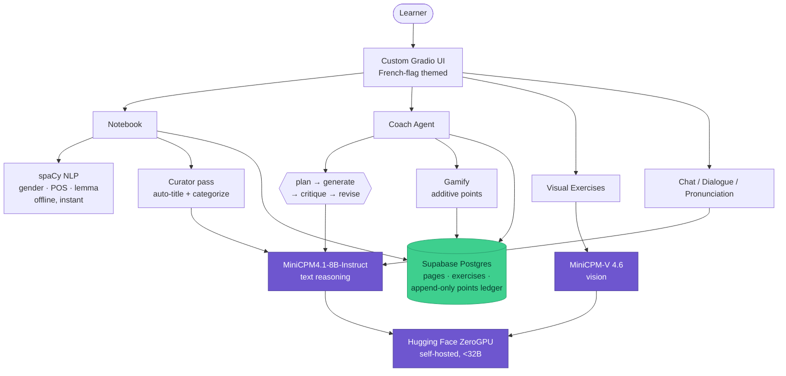

<div align="center">

# 🇫🇷 French Coach

### An agentic French study tutor that turns class notes into grounded practice

A multi-step **Coach Agent** (plan → generate → self-critique → revise) running entirely on **self-hosted MiniCPM models** — text and vision — with deterministic French NLP, a custom Gradio UI, and Postgres-backed persistence.

[](https://www.python.org/)
[](https://www.gradio.app/)
[](https://github.com/OpenBMB/MiniCPM)
[](https://spacy.io/)
[](https://supabase.com/)
[](https://docs.docker.com/compose/)
[](LICENSE)

[🎬 Demo video](https://www.loom.com/share/7b96f5523d104e99a1834509c5d57e1f) · [📣 Build write-up](https://www.linkedin.com/posts/asma-fariha_buildsmall-smallllms-minicpm-share-7472418971804381184-Or_C/) · [🤗 Built on MiniCPM (OpenBMB)](https://github.com/OpenBMB/MiniCPM)

</div>

---

## Overview

**French Coach** turns the usual mess of class notes plus three browser tabs (translate / pronounce / gender-check) into one surface — and adds practice the learner can't get between classes. Built for a real adult learner preparing for Canada's TEF/TCF exams on a four-month timeline (target CLB/NCLC 7), and dogfooded daily.

The point of interest for engineers: the core isn't a single prompt behind a text box. It's a small **multi-step agent that reviews and fixes its own work**, grounded in both the learner's actual lesson and the official CEFR syllabus, with deterministic NLP handling everything that shouldn't touch an LLM.

## What it does

- **Smart notebook** — Write or paste class notes. Nouns are colored by gender at a glance; click any word for meaning, gender, a one-line grammar note, and pronunciation on tap. Saved pages are auto-titled and categorized by a curator pass.
- **The Coach Agent** *(core feature)* — From the current lesson it produces 5–7 mixed exercises (fill-in-the-blank, multiple choice, error detection, reorder, translation) through a **plan → generate → critique → revise** loop. It grounds each set in the lesson *and* the CEFR syllabus, then reviews its own output for a single unambiguous answer before showing it.
- **Visual exercises** — MiniCPM-V reads an image and the app generates French comprehension questions grounded in what's actually in it.
- **Chat coach, dialogue & pronunciation practice** — all grounded in the current lesson.
- **Encouraging by design** — points are additive only, never deducted, never tied to correctness. No streaks to lose, no red error states.

## Architecture



**Design principle:** only meaning, grammar generation, exercises, and dialogue hit the LLM. Deterministic French NLP (gender / part-of-speech / lemma) runs instantly and offline via spaCy — keeping the model calls focused and the UX fast.

## How it's built

| Layer | Choice | Why |
|---|---|---|
| **Text model** | MiniCPM4.1-8B-Instruct (self-hosted on ZeroGPU) | Coach Agent, chat, word cards, grammar, summaries — all under a <32B self-hosting cap; nothing leaves the Space |
| **Vision model** | MiniCPM-V 4.6 (~1.3B) | Reads images for the visual exercises |
| **Agent loop** | plan → generate → critique → revise | Multi-step reasoning that checks and fixes its own output before display |
| **NLP** | spaCy (deterministic) | Gender / POS / lemma, offline and instant — keeps LLM calls focused |
| **UI** | Bespoke Gradio theme (bleu #002395 / rouge #ED2939 on warm paper) | Clearly past the default Gradio look |
| **Persistence** | Supabase (hosted Postgres) | Notebook pages, exercises, and an append-only points ledger |
| **Packaging** | Docker + docker-compose | Reproducible local runs; env-var switch for inference backend |

### Project layout

```
app.py            # Gradio app + UI wiring (main entry)
llm.py            # Model calls / inference backend
prompts.py        # Agent + tool prompts
exercises.py      # Coach Agent: exercise generation + self-critique loop
curator.py        # Auto-title / categorize saved notebook pages
nlp.py            # Deterministic French NLP (spaCy)
notebook.py       # Notebook logic
gamify.py         # Additive points ledger
models.py / db.py # Data models + Supabase/Postgres access
docker-compose.yml, Dockerfile, requirements.txt
```

## Run it locally

```bash
# 1. Clone
git clone https://github.com/AsmaFariha/french-coach-hackathon.git
cd french-coach-hackathon

# 2. Configure (model backend + Supabase creds)
cp .env.example .env   # then fill in values

# 3a. With Docker
docker compose up --build

# 3b. Or directly
pip install -r requirements.txt
python app.py
```

## Why it's more than a chatbot wrapper

The gender-mapped notebook, the image-grounded visual exercises, and above all the Coach Agent's **self-critique loop** make this a tool that reasons in multiple steps and validates its own output — not a single LLM call behind a text box. Deterministic NLP, a self-hosted model stack under a hard size cap, and a real persistence layer make it a complete, deployed product rather than a demo.

---

<div align="center">

Built on [MiniCPM](https://github.com/OpenBMB/MiniCPM) (OpenBMB). Made for one real learner — and dogfooded daily.

</div>
